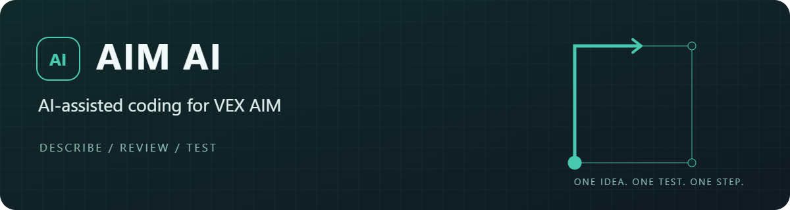
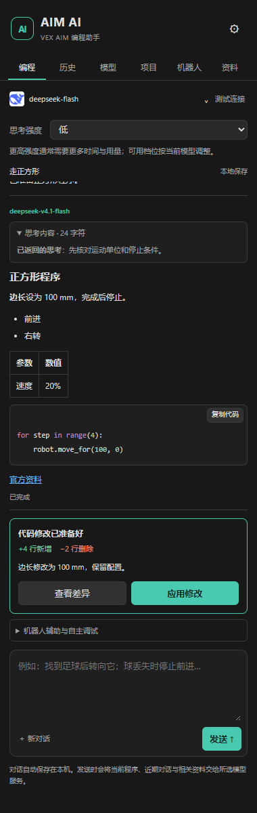
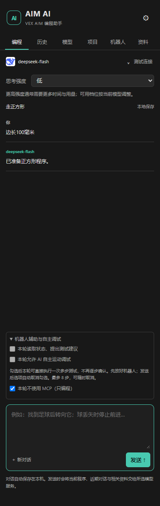

<div align="center">



**Describe, review and debug VEX AIM Python projects in VS Code.**

[简体中文](README.md) · **English**

[](https://github.com/HelloWorld-slc/aim-ai/actions/workflows/ci.yml)
[](https://github.com/HelloWorld-slc/aim-ai/releases/tag/v0.5.1)
[](LICENSE)
[](https://code.visualstudio.com/)

[Download](https://github.com/HelloWorld-slc/aim-ai/releases) · [Robot setup](docs/ROBOT_DEBUG.md) · [Test records](docs/TESTING.md) · [Contribute](CONTRIBUTING.md)

</div>

---

AIM AI brings model chat, AIM API references, code review, project exchange and robot debugging into one VS Code sidebar. Students describe a goal, review the proposed changes and test the result. The project started with a high-school robot football course and also supports introductory motion and vision activities.

> **0.5.1 is a preview release with a vision knowledge update.** Editing and project exchange have been tested. Wi-Fi connection and status reading have worked with one physical AIM robot. Autonomous batch motion is covered by simulation and extension integration tests; physical motion accuracy, downloading and a separate Windows 10 installation still need validation. This is an independent project, not an official VEX Robotics product.

This update adds 12 Chinese vision topics based on 17 official VEX pages: observation, data handling, geometry, environment, recognition errors, AprilTags, color configuration, football tasks, decisions, training limits and testing. Summaries are available offline and through `read_reference`; original task cards and videos remain linked at their official sources. See the [vision guide](resources/knowledge/vision-guide.md).

## Features

| Capability | What it does |
| --- | --- |
| AI coding | Reads the current program and relevant references, then proposes changes |
| Code review | Native side-by-side diff, line counts, explicit apply and restoration |
| Streaming chat | Markdown, syntax highlighting, actual model ID and reasoning text exposed by the provider |
| Local history | Persistent conversations, search, resume, rename and delete |
| AIM references | 44 Chinese reference pages, including every Python category, an MCP parameter guide and 12 vision topics |
| Project exchange | Create, import and export `.aimpython`; open exports in VEXcode AIM |
| Robot debugging | On-demand Wi-Fi connection, selected telemetry fields and bounded batch tests |
| Model choice | DeepSeek, Qwen, Kimi, GLM, OpenAI, Claude, Gemini and custom endpoints |

<p align="center">
  
  &nbsp;&nbsp;
  
</p>

Screenshots use isolated UI fixtures. Model names, answers and robot data shown there are examples, not evidence of live service or hardware testing. The current extension UI and bundled teaching references are in Chinese.

## Quick start

1. Download `aim-ai-0.5.1.vsix` from [Releases](https://github.com/HelloWorld-slc/aim-ai/releases). In VS Code, open Extensions → **⋯ → Install from VSIX**, then run **Developer: Reload Window**. The extension is not currently distributed through the Marketplace.
2. Open an AIM Python **project folder**, containing `.vscode/vex_project_settings.json`. Opening a standalone `.py` file is not enough. Creating or importing a project requires the AIM Python SDK previously installed by the official VEX VS Code extension.
3. Open the **模型 / Models** tab. Choose a provider, confirm the endpoint and model ID, enter your API key and test the connection. Availability and pricing depend on your provider account.
4. Describe your task. Review the diff, click **应用修改 / Apply**, check the program and save. Syntax checks do not establish physical correctness.
5. Click **导出 .aimpython / Export**. By default, the extension opens the file in the installed VEXcode AIM desktop application. Use the official application to connect and download the project.

An `.aimpython` file is a project container, not a renamed `.py` file. Desktop project opening was tested with VEXcode AIM 4.67.0. Browser import still needs separate validation.

## Autonomous MCP debugging

The extension integrates selected functions from [VEX-AIM-MCP](https://github.com/flashzdw/VEX-AIM-MCP) and the [official AIM WebSocket library](https://github.com/VEX-Robotics/AIM_Websocket_Library), with pinned revisions and preserved MIT notices.

1. Open **机器人 / Robot** and click **安装调试环境 / Install debugging environment**. Python 3.10+ is required; dependencies go into a dedicated extension environment.
2. Start with simulation, or [connect the robot to Wi-Fi](docs/ROBOT_DEBUG.md), choose hardware mode and save its IP.
3. Keep on-demand auto-connect enabled. The extension connects only when a robot tool is actually called, not for every message.
4. In the chat composer, expand **机器人辅助与自主调试 / Robot assistance and autonomous debugging**. Check **本轮允许 AI 自主运动调试 / Allow autonomous motion for this turn** before sending a request.

The motion option is **off by default**, is cleared after sending and is not restored from history. When selected, the AI can execute one batch without asking for approval at every step. Without it, the AI can read state and propose a manually executed test.

| Limit | Value |
| --- | --- |
| Batches per turn | 1 |
| Steps per batch | 1–8 |
| Translation per step | 1–200 mm, forward or backward |
| Rotation per step | 1–90°, left or right |
| Speed | 10–30% |
| Batch totals | At most 800 mm translation and 360° rotation |
| Planned duration, including margin | At most 45 seconds |
| Additional state reads / model requests | At most 2 / 3 per turn |

The model is instructed to minimize movement and combine necessary steps into one test. It may request selected telemetry fields or `fields: "all"`. A batch returns a single report containing measurements, per-step errors, tolerances and overall displacement. A deviation or failure stops the remaining steps. Canceling the chat propagates a stop request to the robot backend; network failure can prevent delivery.

Reports compare robot telemetry against the requested motion. They do not certify the real-world path or prove that the entire program in the editor has run correctly. Connecting starts a remote debug session and resets session heading; it is not passive monitoring of a downloaded program. The full parameter and interpretation guide is bundled under **资料 / References → MCP 调试**.

## Using AIM AI without MCP

**MCP is optional.** You can use model chat, references, diffs, history and project export without starting a robot server or installing its Python packages. Select **本轮不使用 MCP（只编程） / Do not use MCP this turn** to override automatic connection, even if a robot has already been configured.

A missing robot environment does not block ordinary coding. If a robot connection fails, the AI receives the error and can continue with static analysis; it must not claim that motion was verified.

## Requirements and limitations

| Component | Needed for |
| --- | --- |
| Desktop VS Code 1.96+ | Running the extension |
| A model API account and internet access | AI features; Chat Completions-compatible and Claude Messages protocols |
| Python 3 | Syntax checking; Python 3.10+ for optional robot debugging |
| Official VEX extension and AIM SDK | Creating/importing projects and experimental download commands |
| VEXcode AIM desktop application | Opening exported projects and official hardware workflows |
| AIM robot and reachable Wi-Fi | Physical debugging; simulation requires no robot |

Local testing used Windows 11. Windows 10 is a classroom target pending separate validation. End users do not need Node.js, Git, Docker, a vector database or another MCP client.

Only single-file AIM Python projects are supported. Saving with auto-export updates the file but does not refresh an already-open VEXcode AIM project. Bluetooth transfer and bidirectional live synchronization are not implemented. The optional official-extension download/run bridge remains experimental and disabled by default.

## Data and cost

API keys use VS Code SecretStorage. Conversations and exposed reasoning text stay in the local workspace extension storage. Requests send the prompt, current source, a bounded history excerpt and relevant reference material to the configured provider. Saved reasoning text is not included in historical excerpts.

Robot telemetry is included when robot tools are used. The extension sends bounded object lists, not camera images or audio. Manual connection, reads and tests do not call a model. AI analysis and tool rounds can incur provider charges; limits reduce repeated requests but do not guarantee a fixed token cost.

## Development

Use Node.js 22+:

```sh
npm ci
npm run typecheck
npm test
npm run build
npm run package
```

For backend tests, create `.robot-runtime` with Python 3.10+, install `robot/requirements.lock`, then run `tests/robot_backend_test.py` and `npm run test:robot`. [CONTRIBUTING.md](CONTRIBUTING.md) also describes isolated VS Code and headless Edge tests.

Source lives in `src/`, the sidebar in `media/`, references in `resources/knowledge/`, and the MCP adapter in `robot/`. Contributions to classroom workflows, API corrections and compatibility testing are welcome. Please distinguish simulation, physical hardware and live model evidence in issues and pull requests.

[Architecture](docs/ARCHITECTURE.md) · [Tests](docs/TESTING.md) · [Changelog](CHANGELOG.md) · [Third-party notices](THIRD_PARTY_NOTICES.md)

## License

Original code is available under the [MIT License](LICENSE). Bundled dependencies retain their own notices. VEX and model-provider names, logos and documentation belong to their respective owners; they do not become MIT-licensed through this project.
